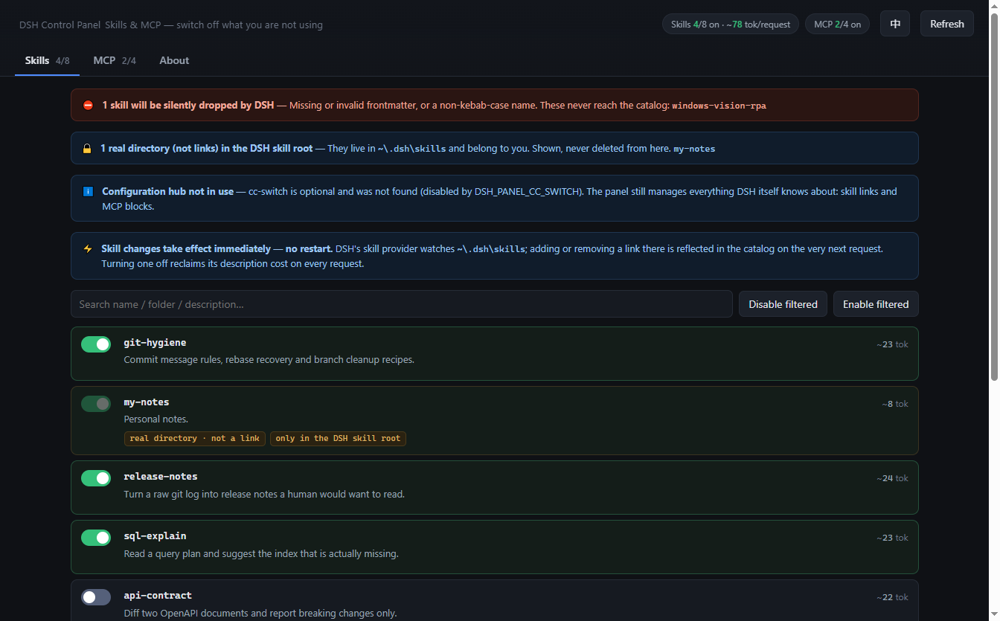
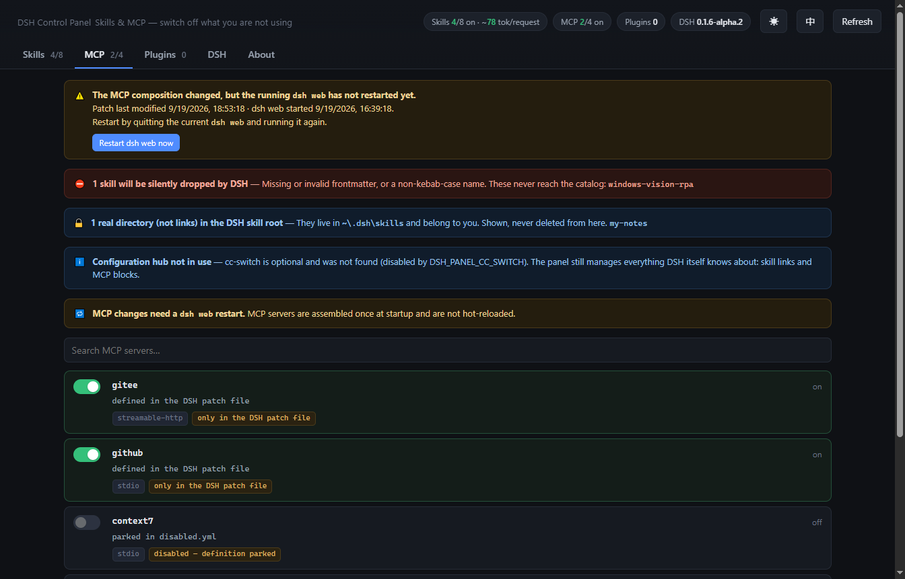
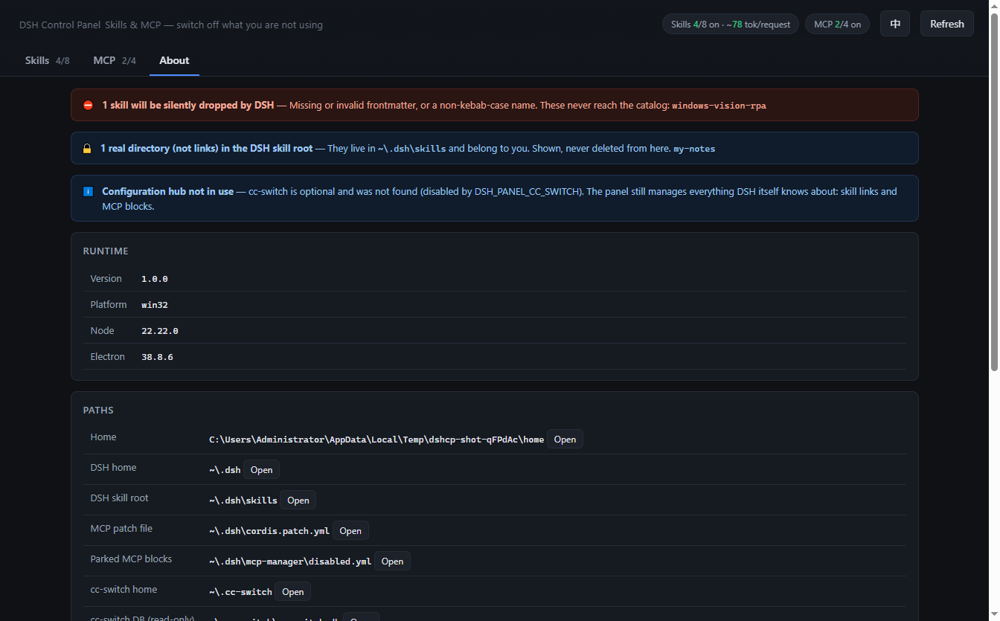
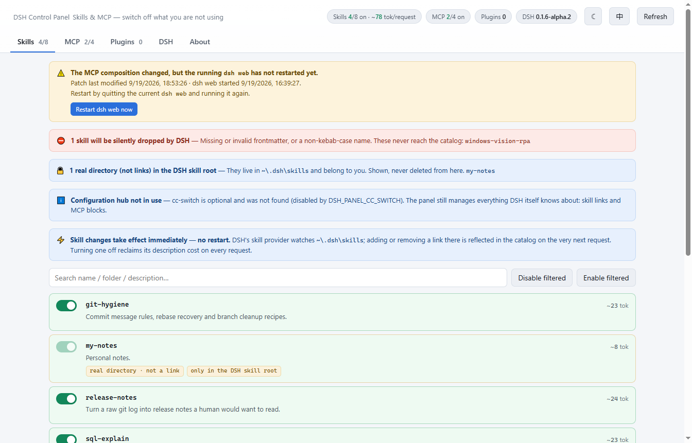

# DSH Control Panel

[](https://github.com/YiShan-X/dsh-control-panel/actions/workflows/ci.yml)
[](https://github.com/YiShan-X/dsh-control-panel/actions/workflows/release.yml)
[](LICENSE)
[](https://nodejs.org)

A desktop app that shows you what your DSH agent pays for on **every single
model request** — and lets you switch the expensive parts off.

If you already run [cc-switch](https://github.com/farion1231/cc-switch), this is
the DSH half of it: your existing skill pool is **soft-routed** to DSH by link,
not imported by copy. No cc-switch? Everything still works — see
[How this differs](#how-this-differs-from-the-other-dsh-tools).

English · [简体中文](README.zh-CN.md)



---

## The problem it solves

Skills and MCP servers are not free. Their definitions are injected into the
context on **every** request, whether or not the model ends up using them:

- The skill catalog alone rides ~2.6–3K tokens per request on a typical install.
- MCP servers are worse, because they ship full tool definitions. A single
  GitHub MCP server is ~4.0K tokens; a Gitee one with 25 tools is ~6.3K.

Turning off the ones you are not using is the only way to get that context back.
This panel makes that a switch instead of a text-editing exercise.



---

## The one thing you must understand

The two halves of the app behave **completely differently**, and the UI never
stops reminding you why:

| | Where the state lives | When a change takes effect |
|---|---|---|
| **Skills** | a link in `$DSH_HOME/skills` pointing at a pool directory | ⚡ **immediately, no restart** |
| **MCP** | a block in `$DSH_HOME/cordis.patch.yml` | 🔁 **only after restarting `dsh web`** |

**Why skills are live:** DSH's `dsh-skill-filesystem` provider watches the skill
root. Adding or removing an entry there rebuilds the catalog, and the change is
visible in the very next request. This is measured behaviour, not an assumption —
see [`docs/ARCHITECTURE.md`](docs/ARCHITECTURE.md) for the experiment.

**Why MCP is not:** MCP servers are assembled once at boot. There is no hot
reload, so the panel instead *tells you* when a restart is genuinely pending — it
compares the patch file's mtime against the running `dsh web` process start time.
If you have not changed anything, it stays quiet.

The **DSH** tab is where that restart happens: it reports the running service
(pid, uptime, command line) and can start, stop or restart it. It is the only
place in the app that manages a process rather than a file, so it is also the
only place that warns you before acting.

---

## How this differs from the other DSH tools

DSH already has several skills/MCP managers, and a cluster of projects that
connect cc-switch to DSH. It is worth being precise about which gap this fills,
because most of that cluster is solving a different problem.

**Most cc-switch ↔ DSH tools move *provider* data** — base URLs, model routes,
API keys ([`dsh-cc-switch`](https://github.com/LKRCharon/dsh-cc-switch),
[`dsh-llm-cc-switch`](https://github.com/Hoemr/dsh-llm-cc-switch),
[`dsh-ccswitch-lite`](https://github.com/jk666T/dsh-ccswitch-lite)). This tool
does not touch providers, models or keys at all. It manages the two things that
ride on *every* request: skills and MCP servers.

**The genuinely close comparison is import versus soft-routing.** Tools that
"import from cc-switch" copy definitions into DSH. This tool never copies a
skill — it links to the same directory on disk:

| | Import | This tool |
|---|---|---|
| What lands in DSH | a copy of the definition | a link to the *same* folder |
| You edit the pool later | changes do not propagate | live on the next request |
| Copies to keep in sync | two | one |
| Turning a skill off | must find and remove the copy | removes the link, pool untouched |

One skill, one copy on disk, and cc-switch and DSH are both looking at it. There
is nothing to re-sync, so there is nothing to drift.

Three consequences of that choice, each of which is a deliberate trade:

- **cc-switch is optional, not a dependency.** It is a read-only *source*. Without
  it you keep per-skill switching over your own pools and full MCP toggle plus
  parking; you only lose one-click generation of a brand-new MCP block from a
  stored definition. Most DSH users have no cc-switch, and the app should not
  pretend otherwise.
- **It never writes to cc-switch.** Its database is opened `readOnly: true` and
  cc-switch has no `enabled_dsh` column, so faking one would mean forking it.
  DSH's own on/off state lives in DSH's own files, where DSH actually looks.
- **It is a standalone desktop app, not a DSH settings-page plugin.** That buys a
  window, tray-less native menus and installers, at the cost of not being
  embedded in DSH's own UI.

**What this tool is not**: it does not meter real token spend. The counts here
are estimates of the *fixed* catalog cost per request, computed as characters /
3.5, and they exist so you can compare orders of magnitude and decide what to
switch off. For usage accounting there are dedicated tools.

If you are evaluating the field,
[`awesome-deepseek-harness`](https://github.com/Dominic789654/awesome-deepseek-harness)
indexes most of it.

---

## Install

### Prebuilt binaries

Grab the installer for your platform from
[Releases](https://github.com/YiShan-X/dsh-control-panel/releases):

| Platform | File |
|---|---|
| Windows | `dsh-control-panel-<version>-x64-setup.exe` (`-arm64-setup.exe` also available), or `dsh-control-panel-<version>-portable.exe` |
| macOS | `dsh-control-panel-<version>-x64.dmg` / `-arm64.dmg` |
| Linux | `dsh-control-panel-<version>-x86_64.AppImage` or `-amd64.deb` |

> The builds are unsigned. Windows SmartScreen and macOS Gatekeeper will warn
> you about an unknown developer; that is expected for a project without a
> code-signing certificate. Build from source if you would rather not click
> through it.

### From source

```bash
git clone https://github.com/YiShan-X/dsh-control-panel.git
cd dsh-control-panel
npm install          # only needed for the desktop shell
npm run desktop      # or: npm run dist:win / dist:mac / dist:linux
```

### Browser mode — no install at all

The core has **zero runtime dependencies**. If you would rather not install
anything, run it as a local web app with nothing but Node:

```bash
node src/cli.mjs           # then open http://127.0.0.1:8791
node src/cli.mjs --help    # all the options
```

On Windows you can also just double-click `start.cmd`, which launches the
desktop app when it is built and silently falls back to browser mode when it is
not.

---

## What it does

**Skills tab**

- One switch per skill, applied instantly
- Per-skill token estimate, and a running total for everything currently on
- Search, and bulk enable/disable across the filtered set
- Shows the catalog name, the folder name, the description, the source
  repository, and which agents the configuration hub has it enabled for

**MCP tab**

- One switch per server; the header banner appears only when a restart is
  actually needed
- Generate a DSH-format config block from a configuration-hub definition, for
  both `stdio` and `streamable-http`
- Automatically wraps `npx` / `uvx` and friends in `cmd /c` on Windows, because
  libuv cannot spawn a `.cmd` shim directly

**Plugins tab — uninstall only**

- Every DSH profile's plugins in one list: the version actually on disk, whether
  the package is a profile layer, and whether it ships a GUI page
- In-box layers (`dsh-base`, `dsh-web-app`) are listed and marked as not
  removable, so it is clear why the removable list is shorter than the roster
  DSH itself shows
- Uninstall runs `dsh plugin --profile <name> remove <pkg>` — the command you
  would type by hand — so `pnpm-lock.yaml` stays in sync with the manifest. A
  running `dsh web` keeps the plugin loaded until it restarts, and the tab says
  so rather than pretending the removal already took effect
- Installing is deliberately **not** offered; that path is `dsh plugin add`

**It also tells you about problems you cannot otherwise see.** The most common
one: a skill whose `SKILL.md` has no frontmatter, or a `name` that is not
kebab-case, is **silently discarded** by DSH — one warning in a log, invisible
from the model's side. You think it is available; it is not. Those skills are
listed in a red banner with the exact reason.



**Interface.** Light and dark themes, following your OS setting until you pick
one from the toggle in the header. The UI is bilingual (English and Simplified
Chinese) as well, and the desktop window hides the native menu bar — it is
developer chrome, and every entry has a keyboard accelerator or a button in the
page. Press <kbd>Alt</kbd> to reveal it if you need DevTools.



---

## Safety guarantees

This tool edits files in your user profile, so the dangerous operations are
simply not implemented:

1. **It never deletes a real directory.** Disabling a skill first proves the
   entry is a link (`lstat`, not `stat`). A real directory is refused with
   HTTP 409 and labelled `real directory · not a link` in the UI.
2. **It never writes to the cc-switch database.** The DB is opened
   `readOnly: true` and no write path exists anywhere in the code. cc-switch is
   a running third-party app; its schema is its own.
3. **It always leaves a valid patch file.** `cordis.patch.yml` must parse to a
   top-level YAML array. Removing the last MCP block leaves an explicit `[]`,
   because a comments-only file parses to `null` and the boot loader throws on
   it — which would stop `dsh web` from starting.
4. **It never overwrites hand-tuned MCP config.** Re-enabling a parked server
   restores the block **verbatim** from `disabled.yml` before cc-switch is ever
   consulted. Regenerating from cc-switch would silently throw away edits made
   after the block was first generated.
5. **It only opens named locations.** The `/api/open` endpoint accepts a fixed
   set of keys, never a caller-supplied path, so a stray web page cannot use the
   local server to launch anything.
6. **It cannot install anything.** Plugin uninstall runs the documented
   `dsh plugin ... remove` command and nothing else, and `/api/plugins/remove`
   refuses any package that is not already a dependency of the named profile.
   A stray web page can therefore not turn the panel into a "run pnpm on this
   spec" primitive. "Uninstalled" is reported only after re-reading the profile
   and finding the dependency actually gone — a pnpm run that exits 0 without
   changing anything is reported as a failure.
7. **It binds to loopback only.** `127.0.0.1` by default, and the desktop build
   uses an OS-assigned port so it can never collide with anything else.

---

## Configuration

Everything is derived from your home directory, so the project folder and the
directories it manages are fully decoupled. The desktop app reads these from the
environment; browser mode additionally accepts `--port` and `--host`.

| Variable | Default | Meaning |
|---|---|---|
| `DSH_HOME` | `~/.dsh` | DSH home directory |
| `DSH_SKILLS_DIR` | `$DSH_HOME/skills` | Where DSH discovers skills (the link target) |
| `DSH_SKILL_POOL` | see below | `${path.delimiter}`-separated list of skill pools |
| `DSH_PATCH_FILE` | `$DSH_HOME/cordis.patch.yml` | Enabled MCP blocks |
| `DSH_DISABLED_FILE` | `$DSH_HOME/mcp-manager/disabled.yml` | Parked MCP blocks |
| `DSH_PROFILES_DIR` | `$DSH_HOME/profiles` | DSH profiles — each one owns its plugins |
| `DSH_PANEL_DSH_PACKAGE` | `@deepseek-ai/dsh` | npm package the version card tracks and installs |
| `DSH_PANEL_REPO` | `YiShan-X/dsh-control-panel` | `owner/repo` the panel's own update check reads |
| `DSH_PANEL_DOWNLOAD_DIR` | `~/Downloads` | Where an update installer is saved |
| `CC_SWITCH_HOME` | `~/.cc-switch` | cc-switch home |
| `DSH_PANEL_CC_SWITCH` | `1` | Set to `0` to ignore cc-switch entirely |
| `DSH_WEB_CMD` | `dsh web` | Command the **DSH** tab's Start button runs |
| `DSH_PANEL_NO_CONTROL` | `0` | Set to `1` to disable start/stop/restart of `dsh web` |
| `DSH_PANEL_PROBE_WEB` | `1` | Set to `0` to stop probing for a running `dsh web` |
| `DSH_PANEL_PORT` | `8791` | Browser-mode port (desktop mode picks a free one) |
| `DSH_PANEL_HOST` | `127.0.0.1` | Browser-mode bind address |
| `DSH_PANEL_POLL_MS` | `30000` | UI auto-refresh interval |

When `DSH_SKILL_POOL` is not set, the pools are the cc-switch skill pool
(`~/.cc-switch/skills`) followed by `$DSH_HOME/skill-pool`.

### The DSH tab controls the service

The **DSH** tab reports the running `dsh web` (pid, uptime, command line, probe
cost) and can start, stop or restart it. Two things are worth knowing:

- **Restarting `dsh web` disconnects anything using it**, including the DSH web
  UI this panel may have been launched from, and the AI session attached to it.
  The panel says so before it acts.
- A **restart replays the command line the running process was started with**,
  so `dsh web --port 3080` keeps its port. If that command no longer resolves on
  this machine — a switched Node version manager is the usual cause — the panel
  falls back to `DSH_WEB_CMD` and tells you, rather than failing silently.

`DSH_PANEL_NO_CONTROL=1` turns the tab into a read-only reporter: the buttons
render disabled with the reason instead of failing on click.

### Which DSH is installed, and whether there is a newer one

The same tab answers "what am I running, and is there an update?":

- **The installed version** is read by running `dsh --version` — through the same
  command the Start button uses, so `DSH_WEB_CMD` cannot make the panel report
  the version of a *different* installation than the one it manages. If that
  command cannot run, the panel falls back to the installed `package.json` and
  says which of the two answered.
- **The published versions** come from `npm view <package> --json`, run with your
  own npm. That is deliberate: your `.npmrc`, your registry mirror and your
  `HTTP_PROXY` / `HTTPS_PROXY` all apply, and the version the panel offers is by
  construction the version an install would fetch. The card shows which registry
  answered.
- **The registry is only contacted when you ask** — once per page load, plus the
  *Check for updates* button. `/api/state` never waits on the network, so an
  unreachable registry cannot make the rest of the panel feel broken; the failure
  is reported in the card instead.
- **Every dist-tag is listed** (`latest`, `next`, `alpha`) with its version and
  publish date, so you can move between channels in either direction. A channel
  behind your installed version is labelled older rather than offered as an
  update.
- **Updating runs `npm install -g <package>@<version>`** and then *re-reads* the
  version. npm exiting 0 is not treated as success: if the `dsh` on your `PATH`
  still reports the old number — a second installation earlier on `PATH` is the
  usual reason — the panel says so instead of claiming it worked.
- **A running `dsh web` keeps the code it booted with**, so the card offers a
  restart once an install has landed after the service started.

Installs are global and the builds are unsigned, so the panel asks for
confirmation naming both versions before it touches anything.

### Keeping the panel itself up to date

The **About** tab carries a second, separate card for the panel's own version —
"is this app current?", which is a different question from "is DSH current?" and
has a different answer mechanism:

- **The running version** comes from the host (`app.getVersion()` in the desktop
  app, `package.json` under the CLI), so it can never disagree with what the app
  reports about itself.
- **The published version** comes from electron-builder's own `latest*.yml`,
  fetched as a release asset. Deliberately *not* the GitHub API: that is
  rate-limited per IP (60 requests/hour unauthenticated), while the asset is
  served like any other file **and** carries the sha512 and size of every
  artifact.
- **Downloads are verified.** The digest is checked before a ~110 MB installer is
  handed to your OS to run; a mismatch deletes the file instead of leaving it
  where you might run it. If a release ever publishes without a digest, the panel
  says the download could not be verified rather than implying it checked.
- **The artifact is the one you would pick by hand**: the `-setup.exe` on
  Windows (not the portable build, which would open a second copy), the `.dmg` on
  macOS (not the `.zip` that exists for electron-updater), the `.AppImage` or
  `.deb` on Linux — matched to your architecture.
- **Only an installed app offers the button.** Running from a source checkout,
  the card says so and the route answers 501, rather than downloading an
  installer for a program you are not running.
- **`HTTP_PROXY` / `HTTPS_PROXY` / `NO_PROXY` are honoured.** Node's built-in
  `fetch` ignores them, so the check goes through the panel's own small HTTP
  client, which uses `CONNECT` and an inner TLS handshake for HTTPS.

The builds are unsigned, so your OS will warn about the developer when the
installer starts. That is expected for a project without a code-signing
certificate.

### The configuration hub is optional

[cc-switch](https://github.com/farion1231/cc-switch) is a multi-agent config
hub that already uses the same "soft routing" pattern this panel implements: one
skill pool on disk, linked into each agent's own skill root. It is used here as
a **read-only source** — the pool plus MCP definitions in its SQLite database.

It does not know about DSH, so DSH's own on/off state lives where DSH expects
it: a link in the skill root, and a delimited block in the patch file.

**Without cc-switch the panel still works.** You keep per-skill switching for
anything in your pool, and full MCP on/off plus parking. What you lose is the
one-click generation of a brand-new MCP block from a stored definition.

The delimited-block format (`# BEGIN MCP: <name>` / `# END MCP: <name>`) is the
same convention the `dsh-mcp-manager` skill's `mcp.ps1` uses, so the two can be
mixed on the same files without either corrupting the other.

---

## Development

```bash
npm test              # unit + integration tests, no test framework
npm run smoke         # boot the real Electron window, then exit
npm run screenshot    # regenerate docs/ using synthetic demo data
npm run icons         # install build/ icons from the design exports in assets/
npm run pack          # electron-builder --dir, unpacked, for quick checks
```

The test suite runs against throwaway sandboxes in the OS temp directory; it
never touches a real profile.

### Layout

```
src/
  core/            zero-dependency panel core, shared by both front-ends
    config.mjs       environment -> explicit config object
    frontmatter.mjs  SKILL.md parsing, without a YAML library
    skills.mjs       skill model, link creation and removal
    mcp.mjs          MCP model, cc-switch -> DSH converter
    plugins.mjs      profile plugin inventory, uninstall via `dsh plugin`
    patch.mjs        the delimited-block editor
    ccswitch.mjs     optional read-only SQLite source
    dsh.mjs          dsh web process probe, cache and lifecycle
    server.mjs       createPanelServer() -- the HTTP layer
  cli.mjs          browser mode
  desktop/main.mjs Electron main process
public/index.html  the whole UI (inline CSS/JS, en + zh-CN)
scripts/           icon generator, smoke test, screenshot generator
```

---

## FAQ

**I toggled an MCP server and nothing happened.**
Working as intended — restart `dsh web`. The banner at the top of the MCP tab
tells you whether a restart is pending, and the DSH tab's **Restart** button does
it (with the warning that it interrupts the current AI session).

**The DSH tab says "not running" but `dsh web` is clearly up.**
The probe looks for a `node.exe` process whose command line mentions both `dsh`
and `web`. A service started under a different executable name or wrapper will
not be found; set `DSH_WEB_CMD` so the Start button can still launch it. If the
status dot is grey with "not probed", probing was switched off with
`DSH_PANEL_PROBE_WEB=0`.

**The page is blank.**
Open the About tab, or hit `http://127.0.0.1:8791/api/state` directly in browser
mode. If that returns JSON, the server is fine and the problem is in the page.
In the desktop app, `Help → Reveal log file` points at the log.

**`cc-switch DB` shows as unavailable.**
The panel degrades to "whatever DSH itself knows about" instead of failing. See
the banner for the exact reason; on an older runtime it is usually that
`node:sqlite` is missing (it needs Node 22.5+ or Electron 38+).

**Does it work on macOS and Linux?**
The core is cross-platform: directory symlinks on POSIX, junctions on Windows,
and the `cmd /c` shim wrapping only applies on Windows. The desktop builds are
produced by CI for all three platforms.

---

## License

[MIT](LICENSE)
