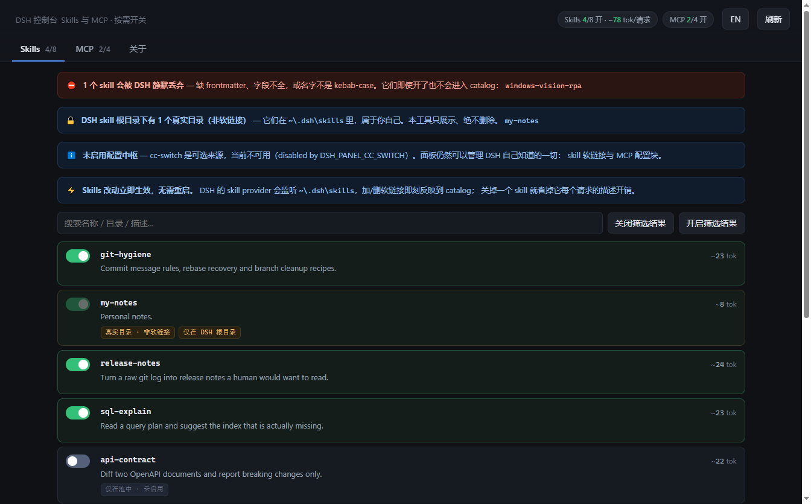
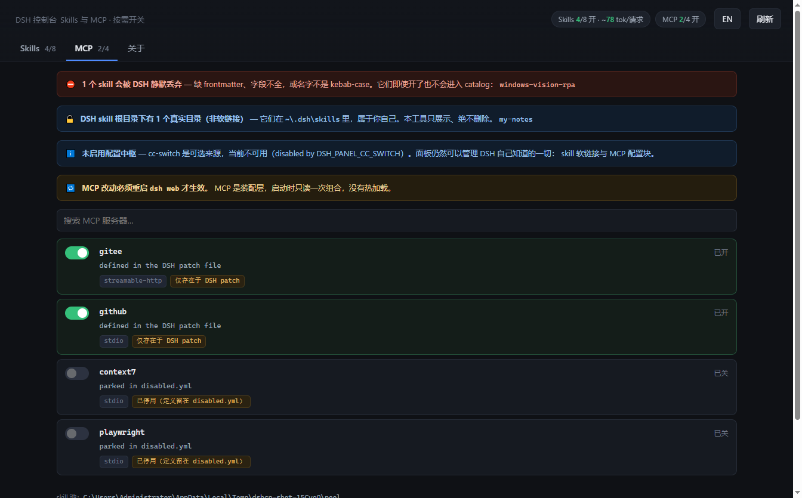
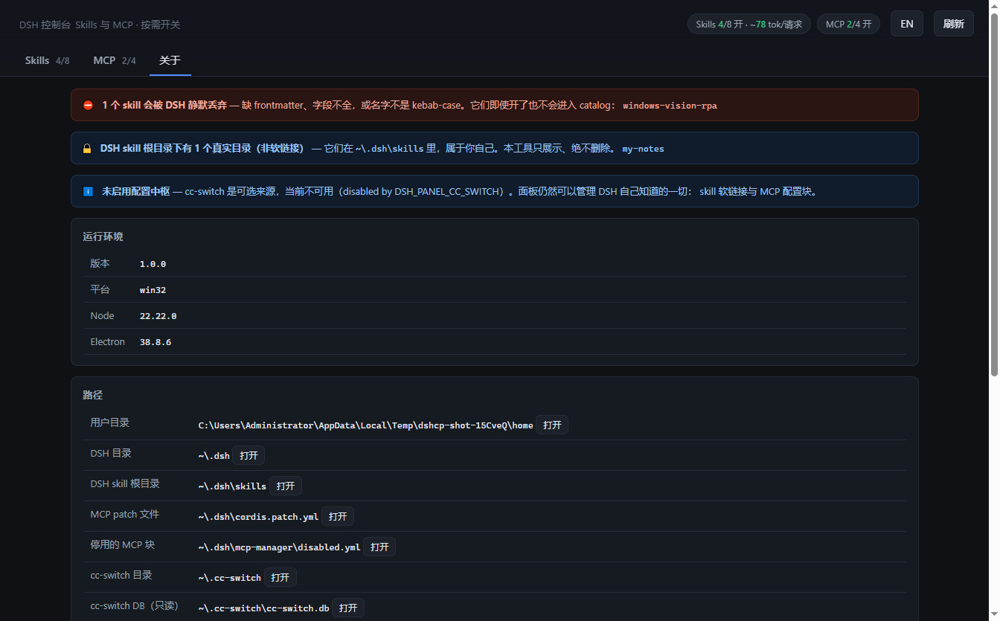

# DSH 控制台 (control-panel)

[](https://github.com/YiShan-X/dsh-control-panel/actions/workflows/ci.yml)
[](https://github.com/YiShan-X/dsh-control-panel/actions/workflows/release.yml)
[](LICENSE)

[English](README.md) · **简体中文**

一个桌面软件，让你看清 DSH 在**每一次模型请求**上为哪些东西付了钱，并把用不上的部分关掉。



---

## 它解决什么问题

skills 和 MCP 服务器的定义**会进入每一次模型请求**，无论你是否用到：

- skill catalog 在一般安装下每请求约 2.6–3K tokens。
- MCP 更贵，因为它带的是完整的工具定义。一个 GitHub MCP 约 4.0K tokens；
  一个带 25 个工具的 Gitee MCP 约 6.3K。

关掉用不上的那些，是唯一能把这些上下文拿回来的手段。本工具把它变成一次点击，
而不是一次文本编辑。



---

## 最重要的一件事：两个机制完全不一样

| | 状态存在哪 | 改动何时生效 |
|---|---|---|
| **Skills** | `$DSH_HOME/skills` 下指向 skill 池的软链接 | ⚡ **立即生效，不用重启** |
| **MCP** | `$DSH_HOME/cordis.patch.yml` 里的配置块 | 🔁 **必须重启 `dsh web`** |

**Skills 为什么能热生效**：DSH 的 `dsh-skill-filesystem` provider 会监听
skill 根目录，加/删条目会触发 catalog 重建，下一次请求立刻可见。这是实测结论，
实验过程见 [`docs/ARCHITECTURE.md`](docs/ARCHITECTURE.md)。

**MCP 为什么不行**：MCP 是装配层，`dsh web` 启动时读一次组合，没有热加载。
所以面板改成**主动告诉你**是否真的有未生效的改动——它把 patch 文件的 mtime 与
正在运行的 `dsh web` 进程启动时间做比较。没改过就不会瞎报警。

---

## 安装

### 直接下载

在 [Releases](https://github.com/YiShan-X/dsh-control-panel/releases) 里选对应平台：

| 平台 | 文件 |
|---|---|
| Windows | `dsh-control-panel-<version>-x64-setup.exe`（另有 `-arm64-setup.exe`），或免安装版 `dsh-control-panel-<version>-portable.exe` |
| macOS | `dsh-control-panel-<version>-x64.dmg` / `-arm64.dmg` |
| Linux | `dsh-control-panel-<version>-x64.AppImage` 或 `.deb` |

> 构建产物未做代码签名，Windows SmartScreen 与 macOS Gatekeeper 会提示未知开发者。
> 这是没有签名证书的项目的正常现象。介意的话可以从源码构建。

### 从源码构建

```bash
git clone https://github.com/YiShan-X/dsh-control-panel.git
cd dsh-control-panel
npm install          # 只有桌面外壳需要
npm run desktop      # 或 npm run dist:win / dist:mac / dist:linux
```

### 浏览器模式 —— 完全不用安装

核心**零运行时依赖**。不想装任何东西的话，只要有 Node 就能跑：

```bash
node src/cli.mjs           # 然后打开 http://127.0.0.1:8791
node src/cli.mjs --help    # 查看全部参数
```

Windows 上也可以直接双击 `start.cmd`：已构建桌面版时启动桌面版，否则自动退回浏览器模式。

---

## 界面能做什么

**Skills 标签页**

- 每个 skill 一个开关，即时生效
- 每个 skill 的 token 估算，以及当前开启项的总计
- 搜索，以及对筛选结果的批量开关
- 显示 catalog 名、目录名、描述、来源 repo，以及配置中枢为哪些 agent 开着它

**MCP 标签页**

- 每个服务器一个开关；顶部横幅只在真的需要重启时出现
- 按配置中枢里的定义一键生成 DSH 格式的配置块，`stdio` 与 `streamable-http` 都支持
- 在 Windows 上自动把 `npx` / `uvx` 这类 shell shim 包进 `cmd /c`——libuv
  无法直接 spawn `.cmd`

**它还会主动告诉你那些你根本看不见的问题。** 最常见的一种：`SKILL.md` 没有
frontmatter、或者 `name` 不是 kebab-case 的 skill，会被 DSH **静默丢弃**——
只在日志里留一条 warning，模型侧完全看不出来。你以为能用，其实一直没生效。
这些 skill 会连原因一起列在红色横幅里。



---

## 安全保证

本工具会改你用户目录下的文件，所以危险操作干脆没有实现：

1. **绝不删除真实目录。** 关闭 skill 前先用 `lstat`（而不是 `stat`）判断是不是软链接。
   真实目录直接返回 HTTP 409，并在 UI 里标成 `真实目录 · 非软链接`。
2. **绝不写 cc-switch 数据库。** 以 `readOnly: true` 打开，代码里不存在任何写 DB 的路径。
   cc-switch 是正在运行的第三方应用，它的 schema 是它自己的。
3. **patch 文件始终保持合法的顶层 YAML 数组。** 移除最后一个 MCP 块后会补上显式的 `[]`，
   因为「只剩注释」的文件会解析成 `null`，而 boot loader 对「存在但不是数组」的 patch
   文件是直接抛错的，会导致 `dsh web` 起不来。
4. **不覆盖你手调过的 MCP 配置。** 重新开启一个已停用的服务器时，优先把 `disabled.yml`
   里的块**原样搬回**；只有 DSH 从来没有过这个块时，才去问配置中枢。
5. **只打开白名单里的位置。** `/api/open` 只接受固定的键，不接受调用方传入的路径，
   免得一个无关网页借用本地服务去启动别的东西。
6. **只监听回环地址。** 默认 `127.0.0.1`；桌面版用系统分配的端口，永不与别的东西冲突。

---

## 配置

所有路径都从用户目录推导，所以项目目录和它管理的目录是解耦的。

| 环境变量 | 默认值 | 含义 |
|---|---|---|
| `DSH_HOME` | `~/.dsh` | DSH 目录 |
| `DSH_SKILLS_DIR` | `$DSH_HOME/skills` | DSH 发现 skill 的位置（软链接目标） |
| `DSH_SKILL_POOL` | 见下 | 用 `${path.delimiter}` 分隔的 skill 池列表 |
| `DSH_PATCH_FILE` | `$DSH_HOME/cordis.patch.yml` | 启用的 MCP 块 |
| `DSH_DISABLED_FILE` | `$DSH_HOME/mcp-manager/disabled.yml` | 停用的 MCP 块 |
| `CC_SWITCH_HOME` | `~/.cc-switch` | cc-switch 目录 |
| `DSH_PANEL_CC_SWITCH` | `1` | 设为 `0` 可完全忽略 cc-switch |
| `DSH_PANEL_PORT` | `8791` | 浏览器模式端口（桌面模式自动选空闲端口） |
| `DSH_PANEL_HOST` | `127.0.0.1` | 浏览器模式监听地址 |
| `DSH_PANEL_POLL_MS` | `30000` | UI 自动刷新间隔 |

未设置 `DSH_SKILL_POOL` 时，skill 池依次为 cc-switch 的池（`~/.cc-switch/skills`）
和 `$DSH_HOME/skill-pool`。

### 配置中枢是可选的

[cc-switch](https://github.com/farion1231/cc-switch) 是一个多 agent 配置中枢，
它已经在用和本工具相同的「软路由」模式：一份磁盘上的 skill 池，软链接进各 agent
自己的 skill 根目录。本工具把它当作**只读来源**——池子加上它 SQLite 里的 MCP 定义。

它不认识 DSH，所以 DSH 自己的开关状态放在 DSH 认的地方：skill 根目录里的软链接，
以及 patch 文件里的分隔块。

**没有 cc-switch 也能用。** 池子里的 skill 照样逐个开关，MCP 也照样启停与寄存。
唯一少掉的是「按已存定义一键生成新 MCP 块」。

分隔块格式（`# BEGIN MCP: <name>` / `# END MCP: <name>`）与 `dsh-mcp-manager`
skill 的 `mcp.ps1` 是同一套约定，两种管理方式可以混用在同一批文件上，互不破坏。

---

## 开发

```bash
npm test              # 70 个单元 + 集成测试，零测试框架
npm run smoke         # 启动真实 Electron 窗口后退出
npm run screenshot    # 用合成演示数据重新生成 docs/ 截图
npm run icons         # 重新生成 build/ 图标（手写 PNG/ICO 编码器）
npm run pack          # electron-builder --dir，免打包快速验证
```

测试跑在系统临时目录里的一次性沙箱中，绝不碰真实用户目录。

---

## 常见问题

**MCP 开了没反应。** 设计如此，必须重启 `dsh web`。MCP 标签页顶部的横幅会告诉你。

**页面一片空白。** 浏览器模式下直接访问 `http://127.0.0.1:8791/api/state`，
能看到 JSON 就说明服务是好的，问题在页面。桌面版用 `Help → Reveal log file` 看日志。

**cc-switch DB 显示不可用。** 面板会降级成「只看 DSH 自己知道的东西」，不会崩。
具体原因看横幅；在较旧的运行时上通常是因为缺少 `node:sqlite`（需要 Node 22.5+ 或 Electron 38+）。

**支持 macOS / Linux 吗？** 核心是跨平台的：POSIX 用目录符号链接，Windows 用 junction，
`cmd /c` 包装只在 Windows 生效。桌面构建由 CI 为三个平台产出。

---

## 许可证

[MIT](LICENSE)
